# Project1 - 영어단어장 만들기

### 실행화면
Create :  [4.단어 추가]  
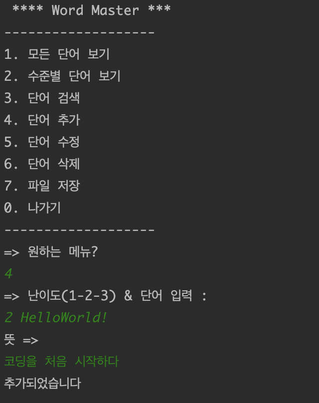

---
**Read : [1.모든 단어 보기]**  
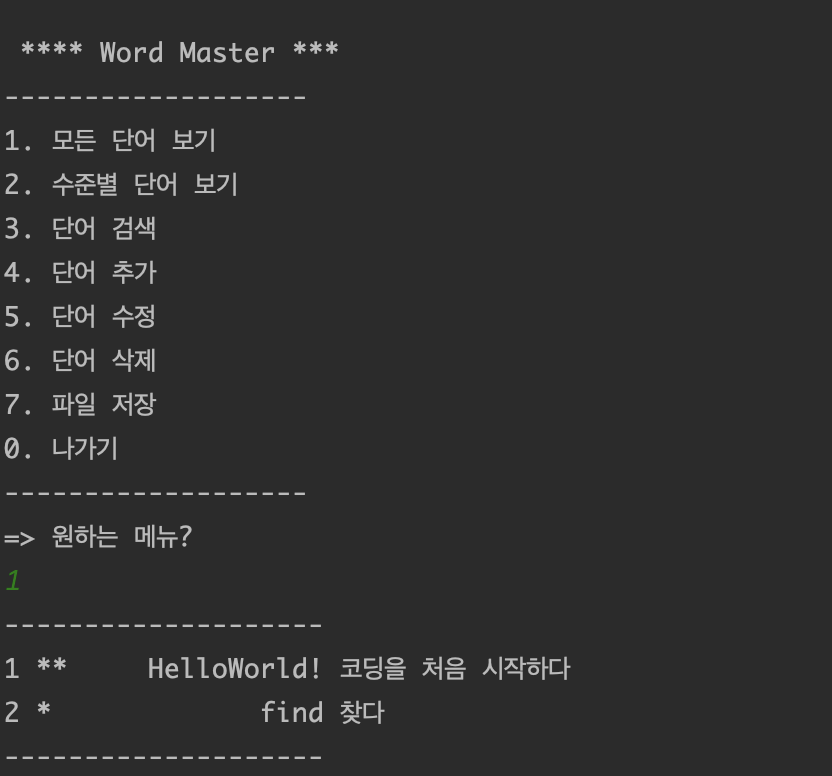
 
[2. 수준별 단어보기]  
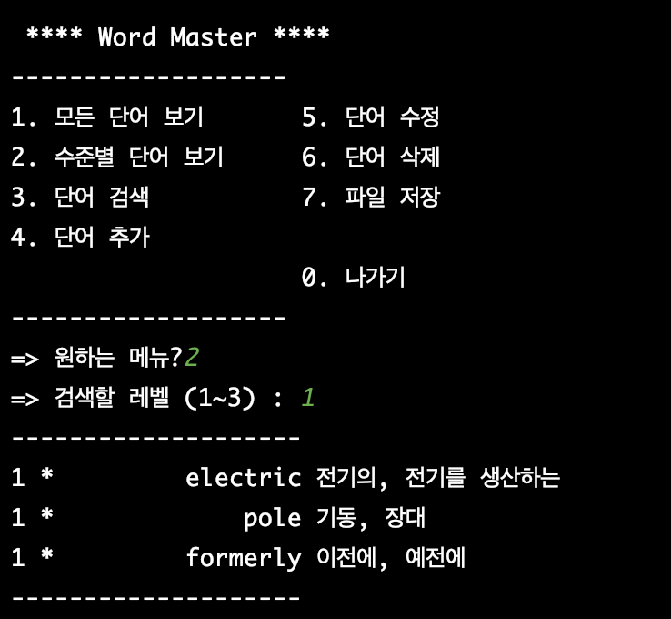
---

Delete : [6. 단어삭제]  
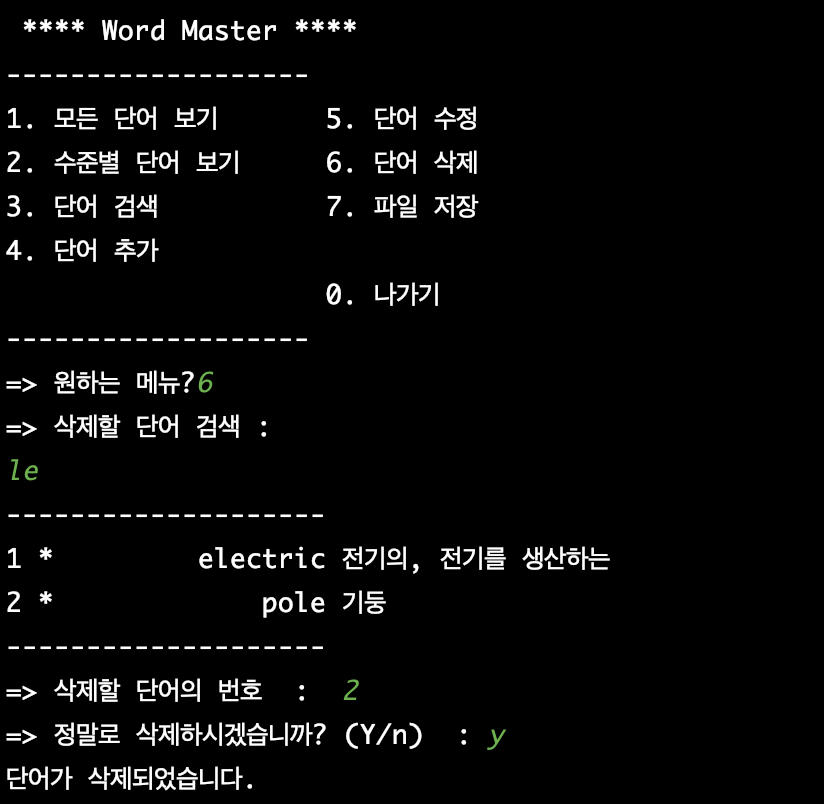
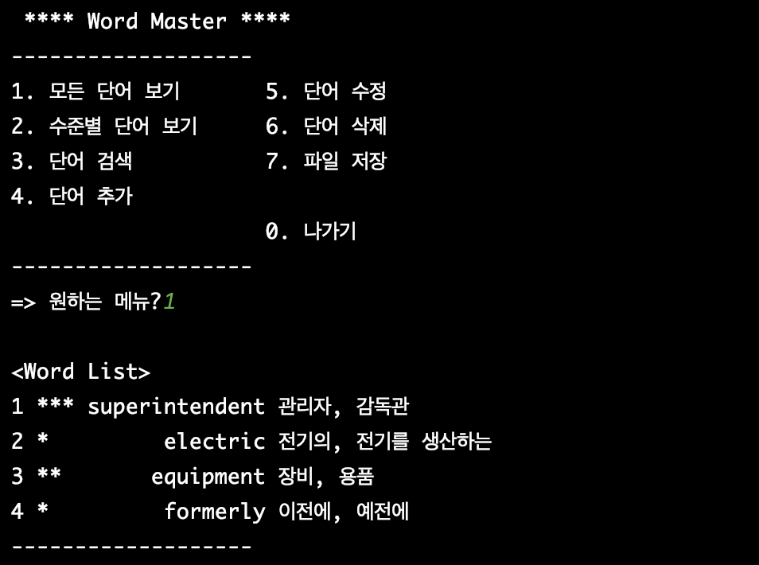
---
[3. 단어검색]  
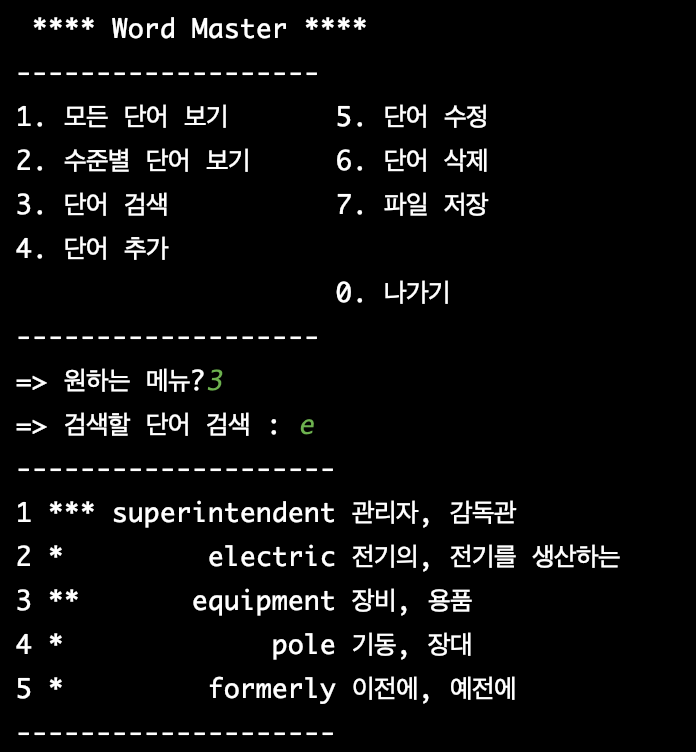
---
[5. 단어수정]  
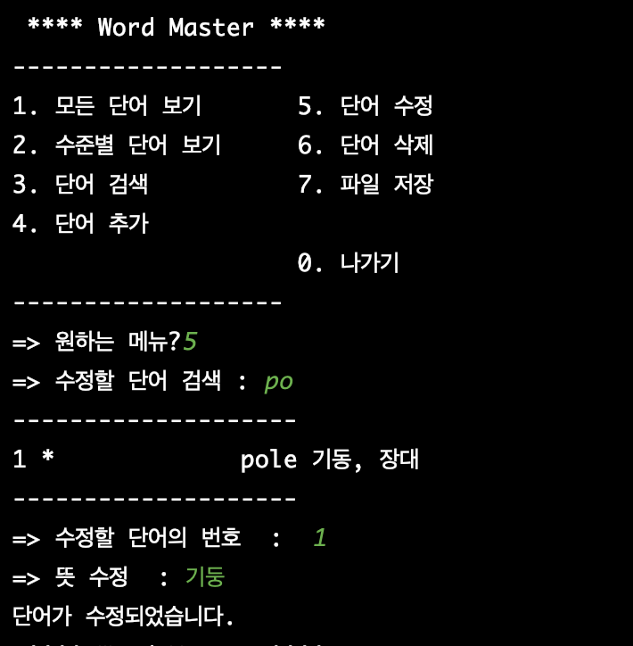

---
FileIO : [7. 파일저장]  
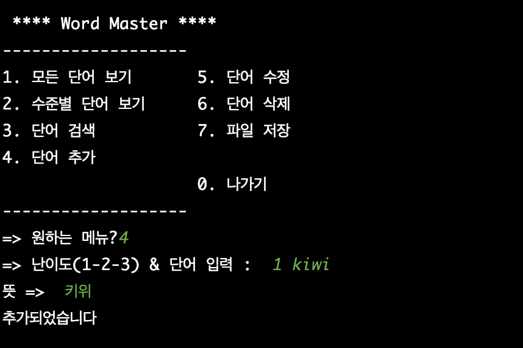
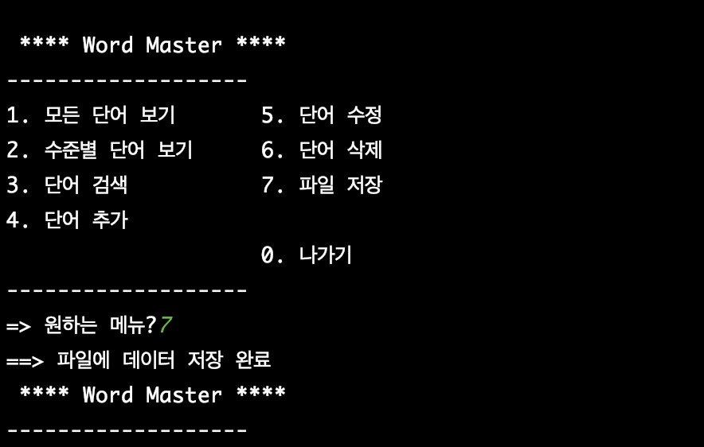
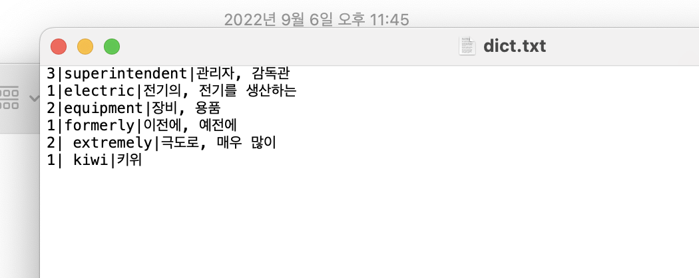
 
[loadFileData]  
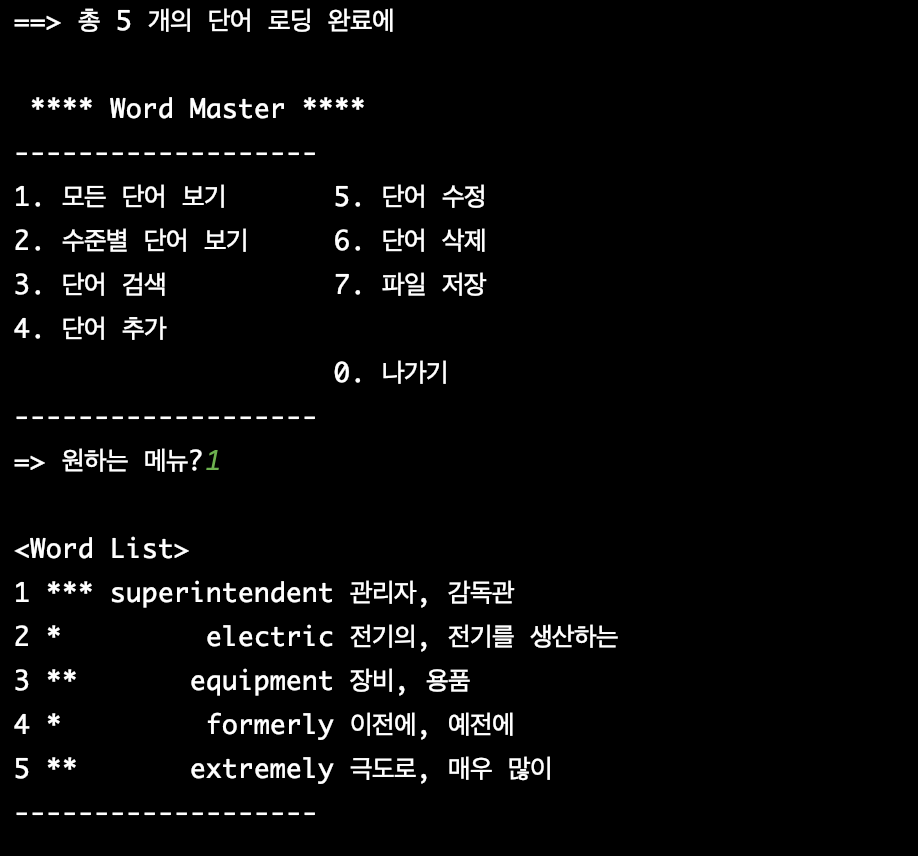
---
Exit :  [0.나가기]  
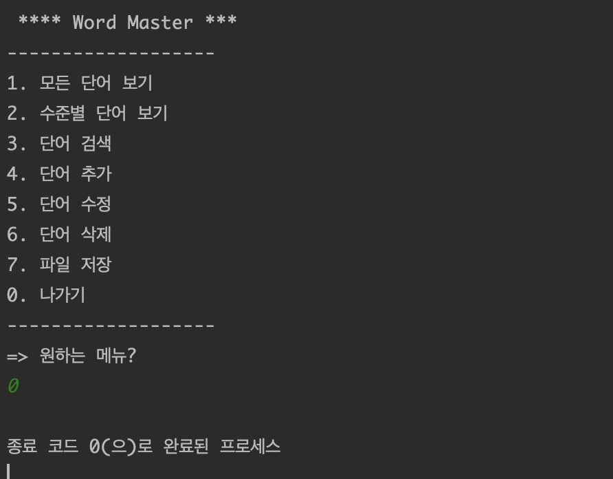

